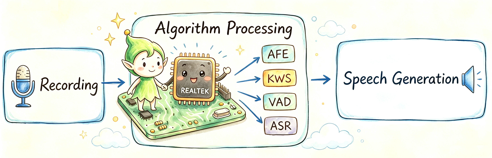

<div align="center">



# SpeechMind

**Always-on AI voice application for Realtek Ameba series chips, built on the AIVoice real-time audio flow.**

[](https://github.com/Ameba-AIoT/ameba-rtos)
[](https://github.com/Ameba-AIoT/ameba-rtos/search?l=c)
[](https://aiot.realmcu.com/en/latest/rtos/index.html)
[](https://aiot.realmcu.com/en/latest/rtos/index.html)

[中文版](README_CN.md) · [ameba-rtos](../../../README.md) · [Documentation](https://aiot.realmcu.com/en/latest/rtos/index.html) · [Products](https://aiot.realmcu.com/en/product/index.html)

</div>

SpeechMind is a Speech Development Kit that demonstrates how to run the AIVoice flow on a real-time audio stream in an always-on manner.

Audio functions such as recording and playback are integrated in the MCU, so the example needs to be used with SpeechMind running in the MCU. The audio recorder sends 3 channels: channel 1 and channel 2 are the microphone signals from a 2mic50mm array, and channel 3 is the AEC reference signal. You can try saying "你好小强", "打开空调", "你好小强", "播放音乐", etc.

> **Note:** the AFE res, KWS lib and FST lib must match the content of the audio, otherwise AIVoice cannot detect.

## 🔌 Supported Chips

| Chip                  |         master         |      release/v1.2      |      release/v1.1      |
|:--------------------- |:----------------------:|:----------------------:|:----------------------:|
| AmebaSmart (RTL8730E) | ![alt text][supported] | ![alt text][supported] | ![alt text][supported] |
| AmebaLite (RTL8720E)  | ![alt text][supported] | ![alt text][supported] | ![alt text][supported] |

[supported]: https://img.shields.io/badge/-supported-green "supported"

> Per-chip feature availability follows the target's Kconfig. Refer to the online SDK documentation for the definitive per-chip feature matrix.

## 🏗️ Repository Structure

```text
speechmind/
├── src/
│   ├── speech_mind.c/.h        # Core always-on speech flow
│   ├── aivoice_manager.c/.h    # AIVoice engine (AFE / VAD / KWS / ASR) manager
│   ├── audio_capture.c/.h      # 3-channel recorder (2 mic + AEC reference)
│   ├── speech_tts.c/.h         # TTS prompt playback
│   ├── music_player.c/.h       # Media player wrapper (MP3 / WAV)
│   ├── playlist*.c             # Playlist management and parsing
│   ├── audio_dump.c/.h         # Dump the live audio stream for debugging
│   ├── pc_recorder.c/.h        # Stream captured audio to a PC
│   ├── speech_config.c/.h      # Runtime configuration
│   ├── test_cmd.c/.h           # Console test commands
│   ├── amebasmart/             # AmebaSmart-specific manager / config
│   └── amebalite/              # AmebaLite build (DSP RPC under aidl/)
├── res/                        # tts / eng_tts MP3 prompts, music, angle params
├── Kconfig                     # Menuconfig options
└── CMakeLists.txt              # Component build entry
```

## ✨ Key Features

- **Always-on wake word** — low-power KWS detection ("你好小强") on a continuous audio stream
- **Command recognition** — on-device ASR command set ("打开空调", "播放音乐" …)
- **2-mic front-end** — AFE with AEC and VAD on a 2mic50mm array (2 mics + AEC reference)
- **TTS & media playback** — MP3 / WAV response prompts and music via the audio media player
- **Debug tooling** — audio dump and PC recorder to capture the live mic / AEC streams
- **Console commands** — quick bring-up and testing from the serial console

## 🔧 Hardware Configuration

Required components: **speaker**.

Connect the speaker to the board.

## 🟢 AmebaSmart

### Software Configuration

**1. Add SpeechMind into the image build**

Add the following line under the\
**###############################  ADD COMPONENT ###################################**\
section in the file\
**amebasmart_gcc_project/project_ap/asdk/make/image2/CMakeLists.txt:**

```cmake
ameba_add_subdirectory_if_exist(${c_CMPT_APP_DIR}/speechmind)
```

**2. Menuconfig**

Type `./menuconfig.py` under the project directory and configure:

```
CONFIG Link Option  --->
    IMG2(Application) running on PSRAM or FLASH? (FLASH)  --->
CONFIG APPLICATION  --->
    Audio Config  --->
        -*- Enable Audio Framework
            Select Audio Interfaces (Mixer)  --->
            Audio Devices  --->
        [*] Enable Media Player
            Media Formats  --->
                [*] WAV
                [*] MP3
    AI Config  --->
        [*] Enable TFLITE MICRO
        [*] Enable AIVoice
            Select AFE Resource (afe_res_2mic50mm)  --->
            Select VAD Resource (vad_v7_200K)  --->
            Select KWS Resource (kws_xiaoqiangxiaoqiang_nihaoxiaoqiang_v4_300K)  --->
            Select ASR Resource (asr_cn_v8_2M)  --->
```

### Build the Resource Bin

**1.** Configure the VFS1 region with `./menuconfig.py`:

```
CONFIG User Config  --->
    Flash Layout Configuration  --->
        (0x8623000) VFS1 Offset
        (0x1DD000)  VFS1 Size
```

**2.** `cp tools/littlefs/linux/mklittlefs component/application/speechmind/res/`

**3.** Set the file permissions: `chmod 777 mklittlefs`

**4.** Build with: `./mklittlefs -b 4096 -p 256 -s 0x1DD000 -c tts tts.bin` (`-s` matches the VFS1 Size above)

### Build and Download

* Refer to the SDK Examples section of the online documentation to generate images.
* Add the image name **test.bin** at the last line with start address **0x08623000**, end address **0x08800000** using the Ameba Image Tool.
* `Download` the images to the board using the Ameba Image Tool.

## 🔵 AmebaLite

### Build the DSP Bin

Follow **examples/speechmind_demo/README.md** in the AIVoice repository.

### Software Configuration

**1. Add SpeechMind into the image build**

Add the following line under the\
**###############################  ADD COMPONENT ###################################**\
section in the file\
**amebalite_gcc_project/project_km4/asdk/make/image2/CMakeLists.txt:**

```cmake
ameba_add_subdirectory_if_exist(${c_CMPT_APP_DIR}/speechmind)
```

**2. Menuconfig**

Type `./menuconfig.py` under the project directory and configure:

```
CONFIG DSP Enable  --->
    [*] Enable DSP
CONFIG Link Option  --->
    IMG2(Application) running on FLASH or PSRAM? (CodeInXip_DataHeapInPsram)  --->
CONFIG APPLICATION  --->
    Audio Config  --->
        -*- Enable Audio Framework
            Select Audio Interfaces (Mixer)  --->
            Audio Devices  --->
        [*] Enable Media Player
            Media Formats  --->
                [*] WAV
                [*] MP3
    IPC Message Queue Config  --->
        [*] Enable IPC Message Queue
        [*]     Enable RPC
```

### Build the Resource Bin

**1.** Configure the VFS1 region with `./menuconfig.py`:

```
CONFIG User Config  --->
    Flash Layout Configuration  --->
        (0x83E0000) VFS1 Offset
        (0x1DD000)  VFS1 Size
```

**2.** `cp tools/littlefs/linux/mklittlefs component/application/speechmind/res/`

**3.** Set the file permissions: `chmod 777 mklittlefs`

**4.** Build with: `./mklittlefs -b 4096 -p 256 -s 0x1DD000 -c tts tts.bin` (`-s` matches the VFS1 Size above)

### Build and Download

* Refer to the SDK Examples section of the online documentation to generate images.
* Add the image name **test.bin** at the last line with start address **0x083E0000**, end address **0x085BD000** using the Ameba Image Tool.
* `Download` the images to the board using the Ameba Image Tool.

## 📚 Documentation

Documentation for the latest version: [FreeRTOS SDK and User Guide](https://aiot.realmcu.com/en/latest/rtos/index.html).

For more information on the Ameba series chips, visit the [product page](https://aiot.realmcu.com/en/product/index.html).

## 📥 SDK Download

SpeechMind builds on the audio framework and the AIVoice engine, which are delivered as submodules of [ameba-rtos](https://github.com/Ameba-AIoT/ameba-rtos) and are only pulled in with the **XDK (Extended)** checkout:

```bash
git clone --recurse-submodules https://github.com/Ameba-AIoT/ameba-rtos.git
```

If you already cloned ameba-rtos without submodules:

```bash
git submodule update --init --recursive
```

> The Basic SDK checkout does not include the audio / AIVoice submodules. To build SpeechMind you must use the XDK checkout above.

## 🌐 Accelerate with Gitee

For users who can access [Gitee](https://gitee.com), we recommend downloading the Gitee mirror of [ameba-rtos](https://gitee.com/ameba-aiot/ameba-rtos) to improve download speed if GitHub is slow. The submodules are pulled in the same way.

## 💬 Feedback

* For questions or suggestions during development, visit the [Real-AIOT Forum](https://forum.real-aiot.com/).
* For bugs or feature requests, [check the GitHub Issues](https://github.com/Ameba-AIoT/ameba-rtos/issues). Please check existing issues before opening a new one.
